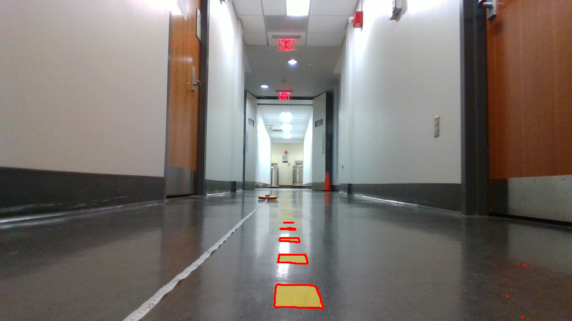
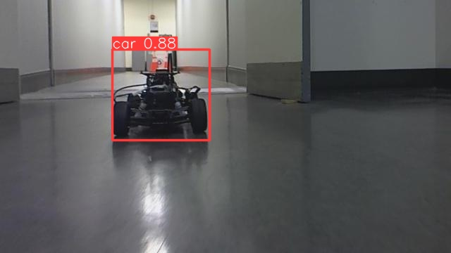
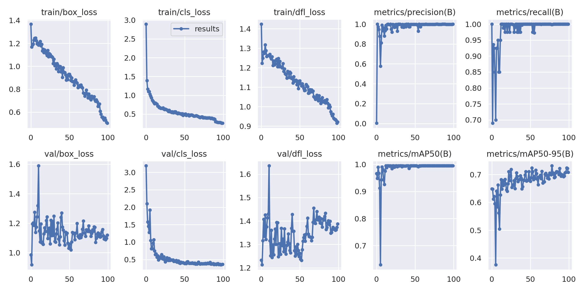
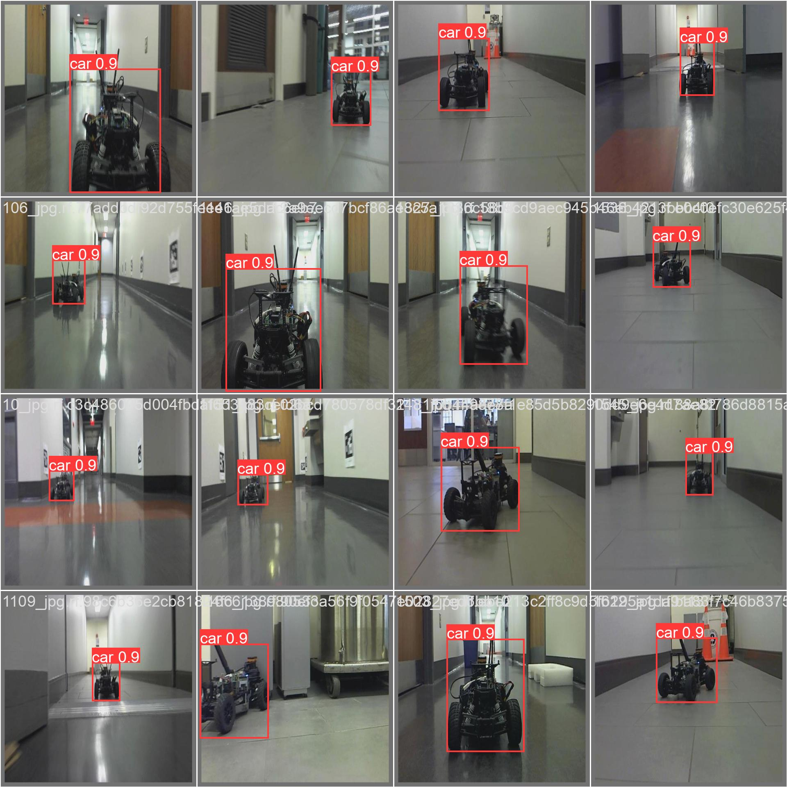

# Lab 8: Vision Lab

## The x, y distance of the unknown cones?

x: 0.6091080208284092 cm

y: -0.1270762728819977 cm

height: 0.1358251090372977

## Lane Detection Result Image

## Integrated Object Detection + Distance Calculation Result Image

## Nerual Network Training & Testing Loss Plot

## Is FP16 faster? Why?
FP16 inference time (ms): (FILL ME IN)

FP32 inference time (ms): (FILL ME IN)

You should time only the inference part and average out at least 100 inference cycles.
