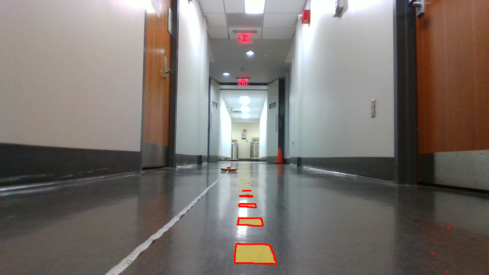

# Lab 8: Vision Lab

## The x, y distance of the unknown cones?

x: 34.43136417712022 cm

y: 24.038544064985025 cm

## Lane Detection Result Image

## Integrated Object Detection + Distance Calculation Result Image
(FILL ME IN)

## Nerual Network Training & Testing Loss Plot
(FILL ME IN)

## Is FP16 faster? Why?
FP16 inference time (ms): (FILL ME IN)

FP32 inference time (ms): (FILL ME IN)

You should time only the inference part and average out at least 100 inference cycles.
