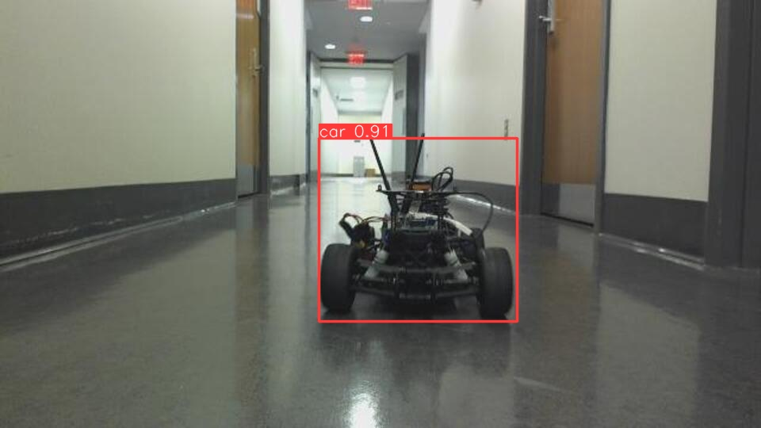

# Lab 8: Vision Lab

## The x, y distance of the unknown cones?

x: 0.6091080208284092 m

y: -0.1270762728819977 m

height: 0.1358251090372977 m

## Lane Detection Result Image

## Integrated Object Detection + Distance Calculation Result Image

Distance to car: 

x:  1.0265792297525804 m

y:  -0.11650568259891672 m

## Nerual Network Training & Testing Loss Plot

Yolov8 Trained by jiyoonp

## Is FP16 faster? Why?

### COULD NOT INSTALL TENORRT on JETSON NANO

#### But we have written the convert_trt.py & tested it

FP16 inference time (ms): (FILL ME IN)

FP32 inference time (ms): (FILL ME IN)

You should time only the inference part and average out at least 100 inference cycles.
